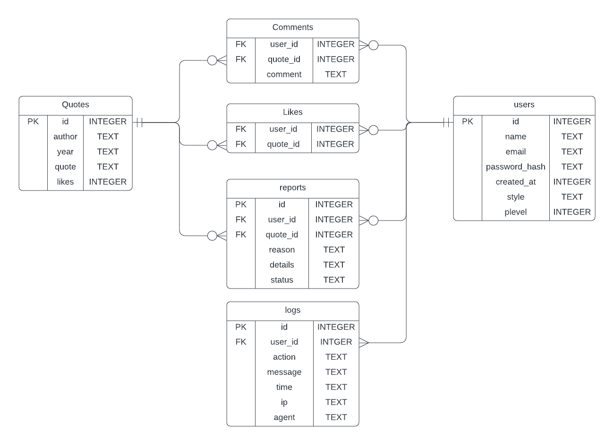

# Database Structure

## Old Structure
users (userid, first_name, last_name, email, date_created, PLEVEL);
reports (reportid, reporter, quoteid, reason, details, status);
log_failed_logins (userid, ip, time, error_message);
log_logins (userid, ip, time);
passwords (userid, hash);
likes (quoteid, userid);
quotes (quoteid, name, year, quote, numlikes);

## New Structure
### Requirements
The new database structuer needs the following capabiitys:
1. To store quotes with id, author, year, quote, and number of likes.
2. To store users with id, name, email, created_at, password, and permission level.
3. To store quote reports with user_id, quote_id, reason, details, and status
4. To log actions made by users, including failed logins, logins, and reports.
5. To store likes with user_id and quote_id.

### DB Diagram

```sql
Table users {
  id int unique [pk, not null]
  name varchar [not null]
  email varchar unique [not null]
  password_hash varchar [not null]
  created_at int [not null]
  plevel int [not null]
}

Table quotes {
  id int unique [pk, not null]
  author varchar [default: "Unknown"]
  year varchar [not null]
  quote varchar [not null]
  likes int [default: 0]
}

Table reports {
  id int unique [pk, not null]
  user_id int [ref: > users.id]
  quote_id int [ref: > quotes.id]
  reason varchar [not null]
  details varchar
  status int
}

Table logs {
  id int unique [pk, not null]
  user_id int [ref: > users.id]
  action varchar
  message varchar
}

Table likes {
  user_id int [ref: > users.id]
  quote_id int [ref: > quotes.id]
}
```
